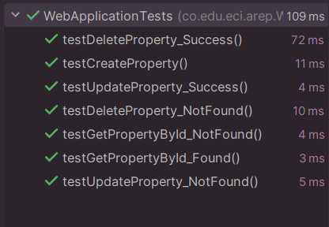

# Property Management System

## Resumen del Proyecto
El Property Management System es una aplicación web que permite a los usuarios gestionar propiedades inmobiliarias de manera eficiente. Proporciona una interfaz intuitiva para agregar, editar, eliminar y buscar propiedades. El sistema está compuesto por un frontend, backend y base de datos que trabajan en conjunto para asegurar una gestión fluida.

## Arquitectura del Sistema
### **Frontend:**
- Construido con **HTML, CSS y JavaScript**.
- Usa un servidor para servir los archivos estáticos.
- Se ejecuta en `http://localhost:3000/`.
- Funcionalidades: listado de propiedades, búsqueda, filtrado y operaciones CRUD.

### **Backend:**
- Desarrollado con **Spring Boot (Java)**.
- Expone APIs REST para gestionar las propiedades.
- Contiene controladores, servicios y repositorios para manejar los datos.
- Se ejecuta en el puerto `8080`, por lo que debe ejecutarse junto con el frontend en puertos distintos.

### **Base de Datos:**
- Utiliza **PostgreSQL** para almacenar los datos de las propiedades.
- Registra información estructurada con campos como `propertyId`, `address`, `price`, `size` y `description`.

### **Interacción del Sistema:**
1. El **frontend** envía solicitudes al **backend API**.
2. El **backend** procesa las solicitudes e interactúa con la **base de datos**.
3. El sistema devuelve los resultados al **frontend** para su visualización.

## Diseño de Clases
### **Clases Principales:**

#### 1. **Property** (Entidad)
```java
@Entity
public class Property {
    @Id
    @GeneratedValue(strategy = GenerationType.IDENTITY)
    private Long id;
    private String address;
    private Double price;
    private Double size;
    private String description;
}
```

#### 2. **PropertyService** (Lógica de Negocio)
```java
@Service
public class PropertyService {

    @Autowired
    private PropertyRepository propertyRepository;

    public Property createProperty(Property property) {
        if (property.getPropertyId() != null && propertyRepository.existsById(property.getPropertyId())) {
            throw new ResponseStatusException(HttpStatus.BAD_REQUEST, "Property exists");
        }
        return propertyRepository.save(property);
    }

    public List<Property> getAllProperties() {
        if(propertyRepository.findAll() != null){
            return (List<Property>) propertyRepository.findAll();
        }
        else {
            throw new ResponseStatusException(HttpStatus.NOT_FOUND, "There is no properties");
        }
    }

    public Property getPropertyById(Long id) {
        Property property = propertyRepository.findById(id).orElse(null);

        if(property != null){
            return property;
        }
        else {
            throw new ResponseStatusException(HttpStatus.NOT_FOUND, "Property not found");
        }

    }

    public Property updateProperty(Long id, Property propertyNew) {
        Property property = propertyRepository.findById(id).orElse(null);
        if(property != null){
            property.setAddress(propertyNew.getAddress());
            property.setDescription(propertyNew.getDescription());
            property.setPrice(propertyNew.getPrice());
            property.setSize(propertyNew.getSize());
            return propertyRepository.save(property);
        }
        else{
            throw new ResponseStatusException(HttpStatus.NOT_FOUND, "Property not found");
        }
    }

    public void deleteProperty(Long id){
        Property property = propertyRepository.findById(id).orElse(null);

        if (property == null){
            throw new ResponseStatusException(HttpStatus.NOT_FOUND, "Property not found");
        }
        else {
            propertyRepository.delete(property);
        }

    }
}
```

#### 3. **PropertyController** (Puntos de Entrada API)
```java
@RestController
@CrossOrigin(origins = "http://localhost:3000")
@RequestMapping(path="/properties")
public class PropertyController {

    @Autowired
    private final PropertyService propertyService;

    public PropertyController(PropertyService propertyService) {
        this.propertyService = propertyService;
    }

    @PostMapping
    public ResponseEntity<Property> addNewProperty(@Validated @RequestBody Property property){
        return new ResponseEntity<>(propertyService.createProperty(property), HttpStatus.CREATED);
    }

    @GetMapping
    public List<Property> getAllProperties(){
        return propertyService.getAllProperties();
    }

    @GetMapping("/{id}")
    public ResponseEntity<Property> getPropertyById(@PathVariable Long id){
        return new ResponseEntity<>(propertyService.getPropertyById(id), HttpStatus.OK);
    }

    @PutMapping("/{id}")
    public ResponseEntity<Property> updateProperty(@PathVariable Long id, @Validated @RequestBody Property property){
        return new ResponseEntity<>(propertyService.updateProperty(id, property), HttpStatus.OK);
    }

    @DeleteMapping("/{id}")
    public ResponseEntity<Void> deleteProperty(@PathVariable Long id){
        propertyService.deleteProperty(id);
        return new ResponseEntity<>(HttpStatus.NO_CONTENT);
    }
}
```

## Instrucciones de Despliegue
### **1. Configuración y Construcción**
#### **Backend (Spring Boot)**
```sh
mvn clean package
```
#### **Frontend**
Servir los archivos del frontend utilizando un servidor estático (por ejemplo, `Live Server` en VS Code o un servidor Nginx en producción).

### **2. Ejecutar los Servicios Localmente**

Ejecutar la aplicación Spring Boot:

Ejecutar el frontend en `http://localhost:3000/` y el backend en `http://localhost:8080/`.

### **3. Despliegue en AWS (EC2)**
1. **Lanzar una instancia EC2 (Ubuntu/Amazon Linux).**
2. **Instalar Java 17 y PostgreSQL.**
3. **Subir y ejecutar el backend:**
```sh
scp -i your-key.pem target/property-management.jar ubuntu@your-ec2-ip:/home/ubuntu/
nohup java -jar property-management.jar --server.port=8080 > output.log 2>&1 &
```
4. **Configurar grupos de seguridad** para permitir tráfico en el puerto `8080`.

## Capturas de Pantalla
### **1. Vista de Lista de Propiedades**


### **2. Agregar una Nueva Propiedad**


### **3. Editar una Propiedad**


Se refleja el cambio


### **4. Eliminar Propiedades**


### **5. Buscar Propiedades**


---

## Pruebas 

